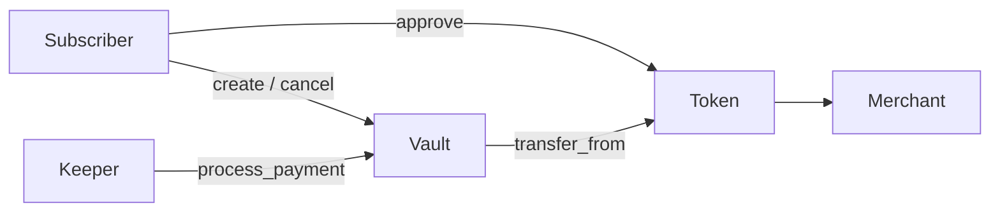

# Recurring Subscriptions — Soroban Auto-Billing Protocol

Non-custodial recurring crypto payments on **Stellar Soroban**. Subscribers grant a token allowance; keepers pull bills on interval; cancellation is instant.

Built for [Drips Wave](https://www.drips.network/wave/) open-source contributors.

## Why this is not a clone

This repo is **not** a port of Vowena, SorobanPay, or streaming-payment designs. Differentiating choices:

| Choice | Why it matters |
|--------|----------------|
| **Permissionless keeper-first** | Anyone can call `process_payment` when due — no privileged merchant cron |
| **Short-symbol event topics** | Stable `sub` / `created` \| `paid` \| `cancelled` prefixes for cheap RPC filters |
| **CEI billing** | `last_billed` is updated before `transfer_from` to block reentrancy double-bills |
| **Dual MIT / Apache-2.0** | Explicit dual licensing for Wave and downstream reuse |
| **Explicit TTL extension** | Create / bill / cancel bump instance + entry TTL (~30 days) |
| **Typed TS SDK + keeper** | First-class packages under `packages/sdk` and `packages/keeper`, not afterthought scripts |

## Architecture

Full write-up: [docs/ARCHITECTURE.md](docs/ARCHITECTURE.md).



## How it works

1. **Approve** — Subscriber calls the SAC token `approve`, granting `SubscriptionVault` an allowance of `(amount × expected_cycles)`.
2. **Create** — Subscriber calls `create_subscription(merchant, token, amount, interval_secs)`.
3. **Bill** — Anyone calls `process_payment(subscription_id)` once `now >= last_billed + interval`.
4. **Pull** — Contract `transfer_from(subscriber → merchant)` via the active allowance.
5. **Cancel** — Subscriber calls `cancel_subscription`; further bills fail. Revoke unused allowance with `approve(..., 0)`.

## Monorepo layout

```
├── contracts/subscription_vault/   # Soroban Rust contract
├── packages/sdk/                   # TypeScript client helpers
├── packages/keeper/                # Permissionless billing bot
├── docs/ARCHITECTURE.md
└── README.md
```

## Prerequisites

- Rust stable (see `rust-toolchain.toml`) with target `wasm32v1-none` (required by soroban-sdk 27+)
- [Stellar CLI](https://developers.stellar.org/docs/tools/cli) (`stellar`)
- Node 20+ (for the SDK)

```bash
rustup target add wasm32v1-none
cargo install --locked stellar-cli --features opt
```

## Build & test the contract

```bash
cargo test -p subscription-vault
cargo build --release --target wasm32v1-none -p subscription-vault
```

Optimized WASM (via Stellar CLI):

```bash
stellar contract build
# → target/wasm32v1-none/release/subscription_vault.wasm
```

> **Note:** If `cargo update` pulls `ed25519-dalek` 3.x and host tests fail to compile, re-pin with:
> `cargo update -p ed25519-dalek --precise 2.2.0`

## Deploy (testnet sketch)

```bash
stellar contract deploy \
  --wasm target/wasm32v1-none/release/subscription_vault.wasm \
  --source-account <SECRET> \
  --network testnet

stellar contract invoke \
  --id <CONTRACT_ID> \
  --source-account <SECRET> \
  --network testnet \
  -- initialize
```

## TypeScript SDK

```bash
cd packages/sdk
npm ci
npm run build
```

```ts
import { SubscriptionClient, NETWORKS } from "@recurring-subscriptions/sdk";

const client = new SubscriptionClient({
  contractId: "C...",
  networkPassphrase: NETWORKS.TESTNET,
  source: "G...",
});

const approve = client.buildApproveOp({
  tokenContractId: "C...USDC",
  subscriber: "G...",
  amount: 100_000n * 12n,
  expirationLedger: 5_000_000,
});

const create = client.buildCreateSubscriptionOp({
  subscriber: "G...",
  merchant: "G...",
  token: "C...USDC",
  amount: 100_000n,
  intervalSecs: 2_592_000n, // ~30 days
});
```

See [packages/sdk/README.md](packages/sdk/README.md).

## Contract API

| Function | Auth | Description |
|----------|------|-------------|
| `initialize()` | — | One-time vault setup |
| `create_subscription(...)` | subscriber | Open a recurring bill |
| `process_payment(id)` | permissionless | Pull one cycle if due |
| `cancel_subscription(sub, id)` | subscriber | Deactivate billing |
| `get_subscription(id)` | — | Read state |

## Contract events

Fixed topics are short Symbols for cheap RPC filters. Dynamic `#[topic]` fields follow.

| Event | Topics | Data |
|-------|--------|------|
| `SubscriptionCreated` | `sub`, `created`, `id`, `subscriber`, `merchant` | `token`, `amount`, `interval_secs` |
| `PaymentProcessed` | `sub`, `paid`, `id`, `subscriber`, `merchant` | `token`, `amount`, `billed_at` |
| `SubscriptionCancelled` | `sub`, `cancelled`, `id`, `subscriber`, `merchant` | _(empty map)_ |

SDK helpers: `EVENT_TOPICS` / `vaultEventTopicFilter` from `@recurring-subscriptions/sdk`.

## Keeper bot

Permissionless relayer that indexes vault events and submits `process_payment` when due.

```bash
cd packages/sdk && npm ci && npm run build
cd ../keeper && npm ci
cp .env.example .env   # fill CONTRACT_ID + KEEPER_SECRET_KEY
npm run build

# Single pass (recommended first)
DRY_RUN=true npm start -- --once

# Inspect CLI
npm start -- --help
npm start -- --version

# Continuous loop
DRY_RUN=false npm start
```

| Env | Purpose |
|-----|---------|
| `RPC_URL` | Soroban RPC endpoint |
| `CONTRACT_ID` | Vault contract (`C...`) |
| `KEEPER_SECRET_KEY` | Fee-paying account (`S...`) |
| `DRY_RUN` | `true` = simulate only (default) |
| `SUBSCRIPTION_IDS` | Optional bootstrap IDs |
| `MAX_ID_SCAN` | Scan `1..N` when event index is empty |
| `STATE_FILE` | Persisted active IDs + event cursor |

Flow each poll: sync `sub/created` & `sub/cancelled` → merge bootstrap/scan → `get_subscription` simulate → if due → `prepareTransaction` + sign + `sendTransaction`.

## Safety notes

- **TTL / rent** — Every create / bill / cancel extends instance + subscription entry TTL (~30 days).
- **CEI** — `last_billed` is written **before** `transfer_from` to prevent reentrancy double-bills.
- **Auth** — Create / cancel require `subscriber.require_auth()`.

## Status / roadmap

Early Wave-ready scaffolding: vault + SDK + keeper. Track work and pick up tasks via [open issues](https://github.com/stellar-recurring/stellar-recurring-payments/issues) (labels: `good-first-issue`, `contract`, `sdk`, `keeper`, `docs`).

## Contributing

See [CONTRIBUTING.md](CONTRIBUTING.md) for fork flow, conventional commits, CI expectations, and Wave guidance.

## Community & policy

- [LICENSE](LICENSE) — dual MIT OR Apache-2.0 ([LICENSE-MIT](LICENSE-MIT), [LICENSE-APACHE](LICENSE-APACHE))
- [CONTRIBUTING.md](CONTRIBUTING.md)
- [CODE_OF_CONDUCT.md](CODE_OF_CONDUCT.md)
- [SECURITY.md](SECURITY.md) — private vulnerability reporting
