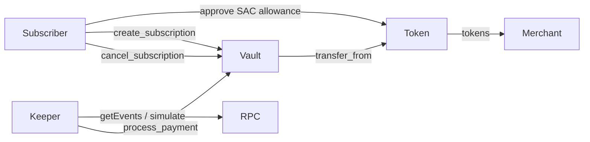

# Architecture

Non-custodial recurring payments on Stellar Soroban: subscribers grant a SAC allowance; a permissionless keeper (or anyone) bills on interval; cancellation is instant.

## Diagram

## Components

| Component | Path | Role |
|-----------|------|------|
| **SubscriptionVault** | `contracts/subscription_vault` | On-chain state, CEI billing, TTL extension, events |
| **SDK** | `packages/sdk` | Typed op builders, due helpers, event topic filters |
| **Keeper** | `packages/keeper` | Indexes vault events, submits due `process_payment` |

## Data flow

1. **Approve** — Subscriber sets SAC `approve` for the vault for `(amount × expected_cycles)`.
2. **Create** — `create_subscription(merchant, token, amount, interval_secs)` stores the subscription and emits `sub` / `created`.
3. **Index** — Keepers watch short-symbol topics via RPC and track active IDs.
4. **Bill** — When `now >= last_billed + interval`, anyone calls `process_payment(id)`; vault pulls via `transfer_from` and emits `sub` / `paid`.
5. **Cancel** — Subscriber `cancel_subscription`; further bills fail; emit `sub` / `cancelled`. Revoke leftover allowance off-chain with `approve(..., 0)`.

## Safety

- **CEI** — Effects (e.g. `last_billed`) are written **before** the external `transfer_from` call to prevent reentrancy double-billing.
- **TTL** — Create / bill / cancel extend instance + subscription entry TTL (~30 days) so live subscriptions do not expire under rent.
- **Auth** — Create and cancel require `subscriber.require_auth()`. Billing is permissionless by design (keeper-first).

## Event topic design

Fixed topics use **short Symbols** so RPC `getEvents` filters stay cheap and stable:

| Event | Topics (prefix) | Notes |
|-------|-----------------|-------|
| Created | `sub`, `created`, … | Dynamic id / parties follow |
| Paid | `sub`, `paid`, … | |
| Cancelled | `sub`, `cancelled`, … | |

SDK: `EVENT_TOPICS` and `vaultEventTopicFilter` in `@recurring-subscriptions/sdk`.

See the root README for the full topic/data table.
